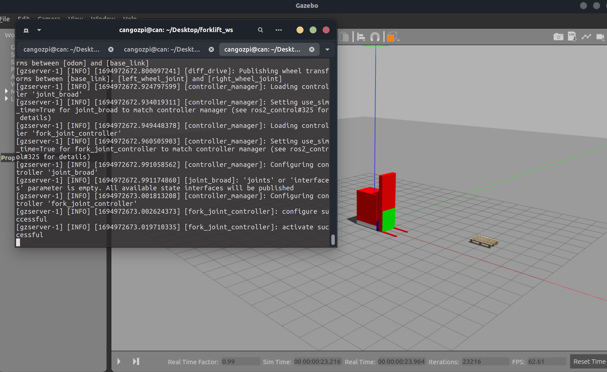
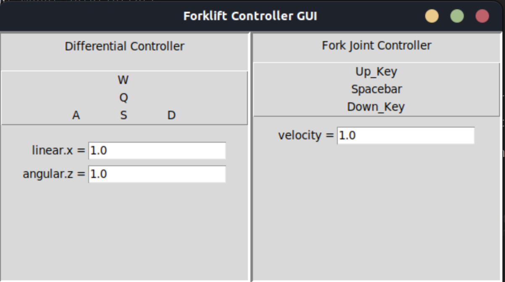
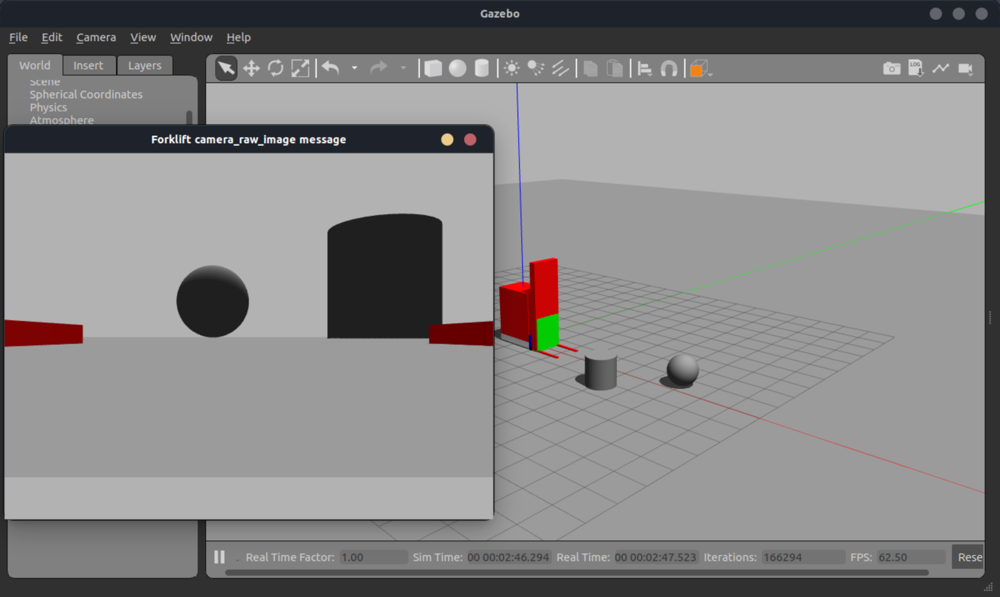
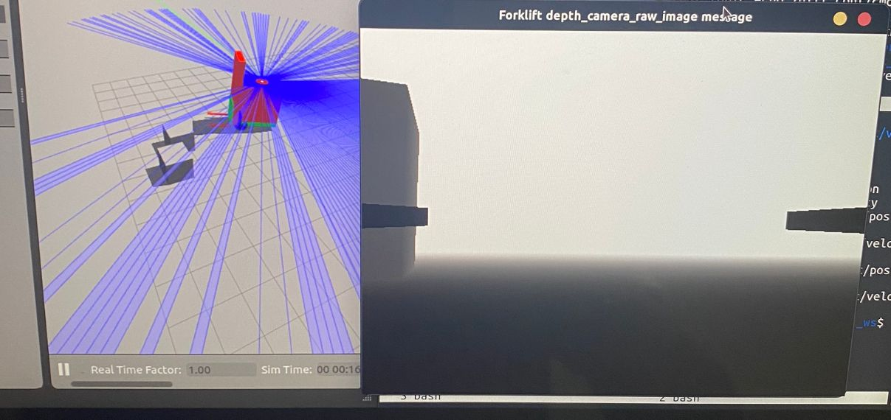
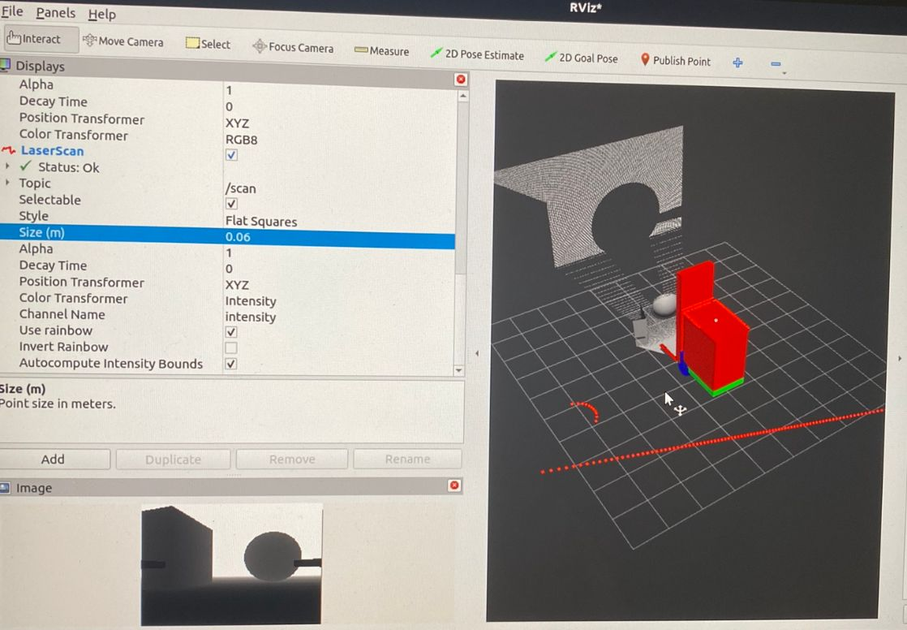

# Deep Reinforcement Learning Forklift Simulation
The aim of this repository is to simulate a forklift model and to train a Deep Reinforcement Learning agent to control the forklift to achieve various tasks such as autonomous navigation to a pallet placed nearby. To this end, it implements a forklift model (urdf) and environment (Gym env) in Gazebo simulation using Robot Operating System 2 (ROS2). There exists various RL methods that can be used to train the agents in the current implementation. DDPG, TD3, PPO are among these supported algorithms. One can choose to use custom pytorch implementations of these algorithms or use implementations from stable baselines 3 (sb3).

## Contributions:
* Forklift Model (e.g. urdf, ros controllers, sensor plugins)
* A Gym Environment (_ForkliftEnv_) based on Gazebo and ROS2 which can be used for simulating a forklift and its environment.
* Pytorch implementations of various Deep Reinforcement Learning algorithms.
* Configuration files to ease the experimentation process.
* GUI interface to manually control the forklift.

## Folder Structure:
* ___src/___ :
  * ___forklift_robot/___ :
    This is a ROS package which contains URDF definitions of the forklift model, ROS controller configurations (for steering the forklift and controlling the fork of the model), and ROS publishers-subscribers used for interacting with the ROS controllers defined and reading sensory inputs from the sensors placed the model.
    * ___urdf/___ : Defines the forklift model, the sensors on the model (e.g. camera, lidar, IMU), and the ROS controllers used to control the model.
    * ___forklift_robot/___ : Implements ROS subscribers-publishers which are used to send commands to the controllers on the forklift model, and read sensory data from the sensors placed on the model.
    * ___config/___ : Defines the ROS Controllers which are used to control the model (e.g. steering, manipulation of the fork).
    * ___launch/___ : Contains some ROS launch files which can be used to test the model by spawning in gazebo and rviz.
  * ___ros_gazebo_plugins___ :
    It contains ROS Gazebo Plugins implementations which are created custom for the model.
    * ___src/ros_collision_detection_plugin.cpp___ : Implements a Sensor Plugin which can be used to detect collisions. It is added to the forklift model to detect it rolling over and crashing to other objects.
  * ___forklift_gym_env/___ : 
    This is a ROS package which contains implementations for reinforcement learning algorithms, _gym_ Environment for training the rl agents (_ForkliftEnv_) while making use of Gazebo and ROS for the simulations, and further utilities for helping through the process (e.g. logging utilities, unit tests, custom gui controllers for the forklift model).
    * ___forklift_gym_env/___ : 
      * ___config/___ : contains config files (_.yaml_) which are used to configure forklift environment parameters (e.g. reward function used, actions the forklift agent supports, gui (gzclient), step duration in the environment), and hyperparameters for the used reinforcement learning (rl) algorithm. It also contains the corresponding training and testing scripts. Refer to comments in the config files for further explanation and insight.
      * ___rl/___ : contains deep reinforcement learning algorithms (rl) which can be used to train forklift agents in the _ForkliftEnv_. It contains implementations from both sb3 (stable baselines 3) and custom pytorch implementations.
        * ___DDPG/___ : pytorch implementation of DDPG-TD3.
        * ___sb3_HER/___ : Uses implementations from sb3 to train agents in the _ForkliftEnv_. Supports algorithms such as PPO, DDPG, TQC, HER. _rl_algorithm_ parameter inside the _train_sb3.py_ file can be changed to use a different rl algorithm.
      * ___envs/___ : contains files which are used to implement a _gym.env_ environment (_ForkliftEnv_). Mainly depends on Gazebo and ROS2. It spawns a forklift model (see _forklift_robot/_ section) which will be controlled by and reinforcement learning agent in a world (_.world_). This environment will be used for training and testing such agents for different tasks which can be easily modified. Currently it aims to train an rl agent to autonomously navigate its environment to reach a pallet (target).
        * ___controller_publishers/___ : Implements ROS publisher nodes which are used to send commands to ROS controllers attached to the forklift model. They are used for steering and manipulating the fork of the forklift model in the environment. In other words, these publishers allow rl agent (forklift) to take actions in the environment.
        * ___sensor_subscribers/___ : Implements ROS subscriber nodes which are used to get state information (e.g. sensory readings such as camera stream, agent and pallet locations) from the simulated _Forkliftenv_.
        * ___forklift_env_Actions_utils.py___ : Makes use of Strategy Pattern to set the corresponding action space. In short it contains utility functions which are related to the actions supported by the _ForkliftEnv_.
        * ___forklift_env_observations_utils.py___ : Makes use of Factory Pattern and Decorator Pattern to set and return corresponding state observations from the _ForkliftEnv_. In short, it contains utility functions which are related to observations (states) obtained from the _ForkliftEnv_ and passed to the rl agent.
        * ___forklift_env_Rewards_utils.py___ : Uses Factory Pattern and Strategy Pattern to instantiate and calculate the corresponding reward function which will be used for guiding the rl agent. It enables switching between _gym.Env_ and _gym.GoalEnv_. This way the same _ForkliftEnv_ implementation can support both _gym.Env_ and _gym.GoalEnv_. In short it contains utility functions which are related to rewards returned by the _ForkliftEnv_ to the rl agent.
        * ___simulation_controller.py___ : It implements a class which can be used for controlling the simulation (gazebo). It can be used for things such as launching robot state publisher, activating ROS controllers, pausing and unpausing the physics of the simulation, changing entity locations (used for resetting the simulation by spawning the model and pallet at certain locations).
        * ___utils.py___ : Implements utility functions for various things such as reading model files (e.g. _.sdf_, _.xacro_), exporting paths used by gazebo, generating and launching ROS launch files, and defining enums which are used for specifying different configurations (e.g. ObservationType, RewardType, ActionType) the _ForkliftEnv_ supports.
        * ___ForkliftEnv.py___ : Implements _ForkliftEnv_ which is a _gym environment_ used for training an rl agent (forklift model). Currently the environment is designed for training an agent to reach a pallet (target/goal). It supports both _gym.Env_ and _gym.GoalEnv_. Supports ROS2, gazebo, rviz for simulations. It can be configured by changing the parameters in the config file (see ___config/___ section). It does not support parallelisation at the moment.
      * ___gui_controller/___ : implements a gui which can be used to manually control the forklift model in the simulation. It is mainly used for testing the ROS controllers attached to the forklift model.
      * ___logging/___ : Implements a Logger class which is used to log metrics to tensorboard, and write logs to (_log_ForkliftEnv.log_) in order to test the resiliency of the ForkliftEnv simulation (e.g. to test things like if _step_duration_ is actually write in between pausing and resuming of the environment).
      * ___test/___ : Implements some pytests for things like replay buffer implementation.
    * ___models/___ : Contains sdf files for models which are not an agent in the environment (i.e. other than forklift model) such as the pallet model.
    * ___worlds/___ : Contains some world files (_.world_) which can be used to spawn the agent in and train.
* ___Makefile___ : used for easing the use of the repository. Contains commands for things such as building via ROS, training/testing using different rl algorithms, launching tensorboard, etc. Read the names of the commands available in this file to get an overall idea.

## Dependencies:
Below are the dependencies which were used during the development of the code:
  * gzclient version 11.10.2
  * gzserver version 11.10.2
  * gazebo version 11.10.2
  * ROS2 Humble
  * See _ros2_pkg_requirements.txt_ for the ros2 packages that were installed on the local machine used during the development of the code(Note that all of them might not be required).
  * Python 3.10.12
  * See _requirements.txt_ for the python packages that were installed on the local machine used during the development of the code (Note that all of them might not be required).
  * Ubuntu 22.04.3


## Running:
Before training or testing the rl agents first you need to build the ROS package. Also you need to clean the build and rebuild it again if you have made changes to the code. Otherwise, those changes would not be reflected when you run the code.
1. Building via ROS:
  * For a clean build of ROS packages:

    This both cleans the previous build files if they exist and build the ROS package from scratch.
      ```bash
      make clean_build
      ```

Next, you need to pick a Reinforcement Learning algorithm and configure it to your needs (e.g. set hyperparameters, switch between training and testing mode). This configuration is done via _config_ (.yaml) which are located in _src/forklift_gym_env/forklift_gym_env/config/*_ (e.g. _src/forklift_gym_env/forklift_gym_env/config/config_DDPG_forklift_env.yaml_). You need to find the config file which corresponds to your choice of rl algorithm and edit it accordingly. Refer to the comments in those config files to further understand what parameters are available and what they do. Available RL algorithms are located in _/src/forklift_gym_env/forklift_gym_env/rl/*_. There exists both custom pytorch implementations and sb3 implementations. Training and testing loops are implemented withing those files and can be opened to figure out which _config_ file is used by a certain rl algorithm. The files with prefixes _*_train.py_ are the training and testing scripts. Don't let the name _train_ in the name of the file fool you to think that these scripts are only for training rl agents (they are also for testing trained agents). These files serve as the entry points to run the code. They initialize rl agents and environments (_ForkliftEnv_) according to their config files and proceed accordingly. Makefile has corresponding commands which can be used to run these scripts. Note that these scripts cannot be run like regular python scripts, instead they require ros run utilities. That is why we have different commands in Makefile to ease the runnign process. Read the commands available in the Makefile to get an idea of the supported implementations. In order to understand which python script is called by any of the training commands in the Makefile, one can cross reference the name of the command run by _$ros run ..._ in the Makefile with the entries in the _entry_points:_ python dictionary defined in the _src/forklift_gym_env/setup.py_ file.

  

  2. Training and Testing RL Agents in _ForkliftEnv_:
  * For running training-testing in _forklift_gym_env/forklift_gym_env/rl/DDPG/train_DDPG.py_:

    This initializes a DDPG agent as configured in _config_DDPG_forklift_env.yaml_. (training/testing is set by the _mode_ parameter in the config by switching between 'train' and 'test').
      ```bash
      make train_DDPG
      ```
    Other rl algorithms can be used via running the following instead:

    For using stable baseline 3 (sb3):
    ```bash
    make train_sb3 # to run 'rl/sb3_HER/train_sb3.py'
    ```
  
Values logged to tensorboard are stored in _logs_tensorboard_ directory. Those logs can be visualized on the browser. Logs are different for custom pytorch implementations of rl algorithms, and sb3 agents.

  3. To View Tensorboard:
  * To view Tensorboard logs by agents using custom pytorch implementations of the rl algorithms:
    ```bash
    make start_tensorboard
    ```
  * To view Tensorboard logs by agents using sb3 implementations of the rl algorithms:
    ```bash
    make start_tensorboard_sb3
    ```
Sometimes simply quitting the running code by <Ctrl + C> would leave some subprocesses (e.g. gzclient, gzserver) running behind and this would cause issues when rerunning your code. This might invest itself as a blank gzclient window which would not seem to load. To fix this you need to make sure all of the related processes are stopped. You can run the following to make sure you've successfully killed all those related processes.

  4. To Kill Related Processes:
  * Kills gzclient, gzserver, gazebo processes.
    ```bash
    make kill_gazebo_processes
    ```

Aside from instantiating a rl agent, you can manually control your forklift model via a gui. It will allow you steer and manipulate the fork of the forklift model by publishing to corresponding ros topics. This can be used for tuning ROS controllers, and observing the behaviour of the available model via an easy to use keyboard interface.

  

  5. To Start the GUI controller on its own (without simulation):
  * This will start the gui controller but it won't start the simulation. If you want to launch the gui along with a simulation with the spawned model then run the next command instead.
    ```bash
    make gui_controller
    ```
  * This will start the gui controller along with a simulation. It will load a world, spawn forklift model and pallet model in it, and load the corresponding ros controllers.
    ```bash
    make manual_launch
    ```

There exists some test code implemented using pytest in the _/src/forklift_gym_env/forklift_gym_env/test/_ folder which you can run.

  6. To run tests:
  * Note that these tests are not extensive and should not be taken as a metric that indicates the overall health of the code implementations.
    ```bash
    make run_pytest
    ```

The aforementioned options and commands make up most of what is required to get set up quickly and extend the results further. On the other hand, one can find explanations of different commands available which are related to the _forklift_robot package_ in the _README.md_ inside that package. One thing that is of concern from that explanation could be the way to speeding up the simulation time with respect to the real world time.

---
### Available Sensors
  1. Camera
  2. Depth Camera
  3. Lidar
  4. Collision Detection Sensor

_Note:_ The available sensors can be turned on or off via commenting and uncommenting the following lines (in _src/forklift_robot/urdf/forklift.urdf.xacro_) accordingly:
```html
    <xacro:include filename="lidar.xacro"/>
    <!-- <xacro:include filename="camera.xacro"/> --> <!-- Uncomment this line, and comment the line below to switch between Depth Camera and a Regular Camera -->
    <xacro:include filename="depth_camera.xacro"/>
```
  
  
  

---
### Available RL algorithms:
1. __DDPG__ implementation in pytorch
2. __TD3__ implementation in pytorch
3. __DDPG+HER__ implementation in pytorch (check out the _feature/HER_ branch (or commit _884104d_) as currently it is not merged)
4. __VPG__ implementation in pytorch (not available in this repository but can be easily copied from my related _Custom Differential Drive Navigaiton Environment and Deep Reinforcement Learning Agents Repository_. See the next section for further information.)
4. __DQN__ implementation in pytorch (not available in this repository but can be easily copied from my related _Custom Differential Drive Navigaiton Environment and Deep Reinforcement Learning Agents Repository_. See the next section for further information.)
6. Anything that __sb3__ supports such as PPO

---
### Custom Differential Drive Navigation Environment and Deep Reinforcement Learning Agents Repository:
This is another repository which I have implemented to simplify the more complex autonomous navigation task I have tackled using this repository. It was aimed at quickly testing algorithms and running quick uncostly experiments. In short, it implements a toy differential drive OpenAI Gym environment, along with some deep reinforcement learning algorithms to train agents on it. It supports custom implementations (pytorch) of the rl algorithms along with some implementations from sb3 which can easily be extended. Environment supports both discrete and continuous action spaces.
Repository can be found at https://github.com/cangozpi/Custom-Differential-Drive-Navigation-Environment-and-Deep-Reinforcement-Learning-Agents.